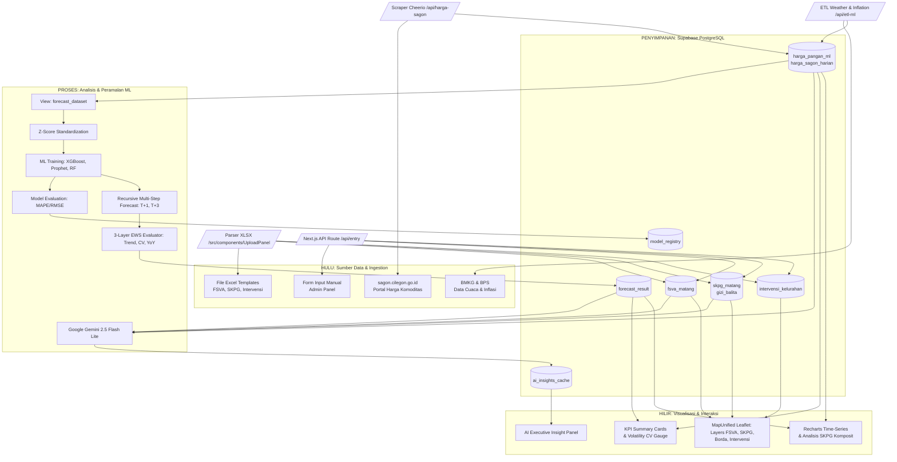

# Dokumen Arsitektur & Spesifikasi Teknis: Dashboard Ketahanan Pangan (Ketapang Cilegon)

Dokumen ini disusun untuk keperluan *technical knowledge* dan *engineering audit* bagi aplikasi **Dashboard Ketahanan Pangan Kota Cilegon** (`https://pangancilegon.web.id`). Dokumen ini merangkum arsitektur sistem, struktur direktori, tumpukan teknologi, alur data dari hulu ke hilir, spesifikasi basis data, serta perincian matematis algoritma pendukung keputusan (Decision Support System/DSS).

---

## 1. Tumpukan Teknologi (Tech Stack)

Aplikasi dibangun menggunakan tumpukan teknologi modern dengan pembagian tanggung jawab sebagai berikut:

### Core Framework & Runtime
* **Framework Utama**: Next.js 16.2.6 (App Router Configuration)
* **Bahasa Pemrograman**: TypeScript (Type-safe compilation)
* **Runtime Environment**: Node.js v20+ / Web Browser
* **Library UI Utama**: React 19.2.4 & React-DOM 19.2.4

### Antarmuka & Visualisasi (Frontend)
* **Styling & Desain**: TailwindCSS v4 dengan `@tailwindcss/postcss` dan Vanilla CSS (`src/app/globals.css`).
* **Visualisasi Geospasial (WebGIS)**: Leaflet & `react-leaflet` untuk menampilkan peta interaktif kelurahan berbasis poligon GeoJSON.
* **Visualisasi Grafik**: `recharts` untuk diagram deret waktu (*time-series*), grafik donat status gizi, dan visualisasi intervensi.
* **Ikonografi**: `lucide-react`.

### Basis Data & Backend (Database & API)
* **Basis Data**: Supabase (PostgreSQL) dengan akses client-side terenkripsi menggunakan public anonymous key.
* **Serverless Backend**: Next.js Route Handlers (Folder `src/app/api/`) sebagai endpoint penanganan ETL, ML, dan AI.
* **AI Analysis Engine**: Google Gemini API via model `gemini-2.5-flash-lite` untuk memproduksi ringkasan eksekutif secara dinamis.

### Library Utilitas Utama
* **Cheerio (`^1.2.0`)**: Parser HTML untuk scraping data harga pasar harian dari portal eksternal SAGON.
* **XLSX (`^0.18.5`)**: Engine pembaca dan penulis spreadsheet untuk proses unggah data FSVA, SKPG, dan Intervensi.
* **Turf.js (`^7.3.5`)**: Pustaka kalkulasi spasial untuk menganalisis koordinat wilayah Kota Cilegon.
* **Mapbox ToGeoJSON (`^0.16.2`)**: Konverter format batas wilayah KML/KMZ menjadi GeoJSON standar.

---

## 2. Struktur Folder & Berkas (Folder & File Structure)

Berikut adalah struktur repositori aplikasi yang terorganisir secara modular:

```text
dashboard-ketapang/
├── public/                       # Aset statis (Gambar, logo, batas poligon kelurahan KML/GeoJSON)
├── src/
│   ├── app/                      # Direktori Next.js App Router (Halaman & API)
│   │   ├── admin/                # Panel kontrol administrator
│   │   ├── api/                  # REST API Endpoints
│   │   │   ├── ai-insight/       # Endpoint analisis AI (Gemini) beserta cache
│   │   │   ├── etl-ml/           # Sinkronisasi parameter eksternal (inflasi, cuaca, harga)
│   │   │   ├── harga-sagon/      # Scraper harga pasar harian SAGON Cilegon
│   │   │   ├── ml/               # Sub-sistem Machine Learning (predict, retrain, explain)
│   │   │   └── sagon-bulanan/    # Scraper harga indeks bulanan SAGON
│   │   ├── entry/                # Halaman unggah template Excel & input manual
│   │   ├── forecast/             # Halaman visualisasi peramalan harga & EWS
│   │   ├── globals.css           # Konfigurasi CSS global & variabel tema
│   │   ├── layout.tsx            # Wrapper HTML dasar dan navigasi global
│   │   └── page.tsx              # Beranda Dashboard (WebGIS MapUnified & Slider KPI)
│   ├── components/               # Komponen Antarmuka React (Reusable UI)
│   │   ├── AIInsightPanel.tsx    # Panel penampil analisis laporan Gemini AI / Heuristic
│   │   ├── AnalisisSKPG.tsx      # Komponen grid data SKPG kecamatan & komposit bulanan
│   │   ├── BalitaDoughnut.tsx    # Grafik status gizi balita underweight/wasting
│   │   ├── CVGauge.tsx           # Gauge volatilitas harga beras/komoditas
│   │   ├── ForecastPanel.tsx     # Tabel indikasi harga depan & ambang batas EWS
│   │   ├── HargaPanel.tsx        # Panel monitoring pergerakan harga pasar riil
│   │   ├── MapUnified.tsx        # Kontainer peta Leaflet & logika pemilih layer
│   │   ├── MapLayers.tsx         # Manajemen penggambaran vektor poligon & popup kelurahan
│   │   └── UploadPanel.tsx       # Modul pembaca spreadsheet xlsx & form input admin
│   └── lib/                      # Pustaka Logika & Core Engine
│       ├── fsva/                 # Modul penghitungan Indeks Ketahanan Pangan (IKP)
│       │   ├── composite-score.ts# Formulasi penjumlahan tertimbang indikator
│       │   ├── constants.ts      # Bobot pilar NCPR dan ambang prioritas IKP
│       │   └── normalization.ts  # Fungsi normalisasi min-max skala 0 - 100
│       ├── ml/                   # Modul Machine Learning Core (TypeScript murni)
│       │   ├── algorithms.ts     # Implementasi LinearRegression, XGBoost, Prophet, RF
│       │   ├── evaluate.ts       # Metrik evaluasi performa model (MAPE, RMSE, MAE)
│       │   ├── explain.ts        # Explainer faktor pengaruh (lags, weather, calendar)
│       │   └── train_model.ts    # Pipeline training, selection, forecasting, & save
│       ├── benchmark.ts          # Batas ambang gizi & harga standar nasional
│       ├── etl-sagon.ts          # Integrasi scraper SAGON dengan database
│       ├── supabase.ts           # Inisialisasi client Supabase
│       └── wilayah.ts            # Mapping relasi administrasi Kecamatan & Kelurahan Cilegon
├── migrate_*.sql                 # Skrip migrasi DDL database PostgreSQL
├── package.json                  # Konfigurasi dependensi project & script NPM
└── tsconfig.json                 # Konfigurasi compiler TypeScript
```

---

## 3. Arsitektur & Aliran Data Hulu ke Hilir

Arsitektur aplikasi didesain dengan model **Data-Driven Decision Support System** yang mengalirkan data dari sumber mentah (Hulu) hingga menjadi antarmuka interaktif dan keputusan taktis (Hilir).

### Diagram Aliran Data (Data Flow Diagram)



### Uraian Alur Hulu ke Hilir:

1. **HULU (Akuisisi Data / Data Ingestion)**:
   * **Scraping Otomatis**: Endpoint `/api/harga-sagon` dijalankan secara berkala untuk melakukan scraping data harga harian dari situs SAGON Cilegon. Data diambil menggunakan `cheerio` untuk mem-parsing tabel HTML dari 3 pasar utama (Pasar Baru Cilegon, Pasar Blok F, Pasar Baru Merak).
   * **Data Makro & Cuaca**: Endpoint `/api/etl-ml` memicu ETL untuk memproses data inflasi bulanan Kota Cilegon dari BPS dan parameter cuaca (curah hujan, suhu, kelembapan) dari BMKG.
   * **Unggahan Pengguna (Excel)**: Melalui antarmuka `/entry`, pengguna (petugas Dinas) mengunggah spreadsheet Excel berisikan data FSVA, SKPG bulanan, dan data intervensi kelurahan. Pustaka `xlsx` bertugas mengekstrak dan memvalidasi baris data.
   * **Input Manual**: Administrator juga dapat menginputkan data secara langsung melalui formulir web.

2. **WADAH (Penyimpanan / Database)**:
   * Seluruh data yang berhasil divalidasi disimpan ke dalam tabel-tabel di basis data Supabase (PostgreSQL).
   * Database dirancang dengan relasi spasial berdasarkan administrasi (Kecamatan dan Kelurahan). RLS dinonaktifkan untuk tabel publik guna mempermudah sinkronisasi seeder.

3. **PROSES (Analisis, Machine Learning & AI)**:
   * **Penyusunan Fitur (Feature Engineering)**: Sistem menggabungkan data harga, inflasi, cuaca, dan kalender hari raya menjadi satu kesatuan data di view PostgreSQL `forecast_dataset`. Dari data tersebut, sistem merekayasa 25 fitur numerik.
   * **Pelatihan & Seleksi Model**: Pipeline ML (`train_model.ts`) melatih 3 jenis algoritma secara paralel: *Prophet-like Additive*, *XGBoost*, dan *Random Forest*. Model divalidasi menggunakan data tahun terbaru (2026). Model dengan nilai kesalahan terkecil (*Mean Absolute Percentage Error* / MAPE) dipilih sebagai model *champion* untuk komoditas tersebut dan dicatat ke tabel `model_registry`.
   * **Peramalan Rekursif (Forecasting)**: Model *champion* melakukan peramalan rekursif untuk 1 bulan (T+1) dan 3 bulan ke depan (T+3) dengan menyisipkan hasil prediksi sebelumnya sebagai nilai lag baru.
   * **Early Warning System (EWS)**: Hasil peramalan dievaluasi pada modul EWS untuk menentukan tingkat kerawanan berdasarkan perubahan harga (Trend), indeks volatilitas (CV), dan pertumbuhan YoY (SKPG).
   * **AI Insights**: Data historis, prediksi harga, dan status gizi balita dikirimkan ke Google Gemini API untuk memproduksi analisis naratif eksekutif. Laporan di-cache di tabel `ai_insights_cache` selama 6 jam untuk efisiensi kuota API.

4. **HILIR (Visualisasi / Decision Support)**:
   * **Dashboard Utama**: Menampilkan peta spasial Kota Cilegon (`MapUnified.tsx`) dengan Leaflet. Peta ini dapat berganti mode untuk menyajikan:
     - **Layer FSVA**: Klasifikasi tingkat kerentanan pangan kelurahan dalam 6 prioritas BAPANAS.
     - **Layer SKPG**: Distribusi prevalensi balita kurus (*Underweight*) per kelurahan.
     - **Layer Borda Count**: Pemetaan prioritas intervensi kelurahan (gabungan indikator FSVA & SKPG).
     - **Layer Intervensi**: Persebaran program bantuan pangan dan operasi pasar murah (GPM).
   * **Panel Analisis**: Menyediakan diagram tren harga dari `recharts`, meteran volatilitas harian, visualisasi data komposit SKPG bulanan, dan panel narasi AI Insight.

---

## 4. Spesifikasi Skema Database (Supabase PostgreSQL)

Berikut adalah tabel-tabel utama yang mengelola data dalam dashboard:

### 1. `harga_pangan_ml`
Menyimpan rata-rata harga bulanan komoditas pangan dari SAGON (gabungan data scraping & ekstrapolasi).
* `tahun` (INT, Primary Key)
* `bulan` (INT, Primary Key)
* `harga_beras` s.d `harga_minyak_goreng` (INT) - Harga dalam Rupiah untuk 10 komoditas strategis.

### 2. `fsva_matang`
Menyimpan Indeks Ketahanan Pangan (IKP) kelurahan hasil perhitungan komposit FSVA.
* `id` (BIGINT, Primary Key)
* `tahun` (INT)
* `kecamatan` (VARCHAR)
* `kelurahan` (VARCHAR)
* `ikp` (NUMERIC) - Nilai komposit IKP.
* `prioritas` (INT) - Kategori kerentanan (Skala 1 - 6).

### 3. `skpg_matang` (atau `gizi_balita`)
Menyimpan data survei bulanan kondisi fisik balita per kelurahan.
* `id` (BIGINT, Primary Key)
* `tahun` (INT)
* `bulan` (INT)
* `kecamatan` (VARCHAR)
* `kelurahan` (VARCHAR)
* `gizi_kurang` (INT) - Jumlah balita gizi kurang.
* `gizi_sangat_kurang` (INT) - Jumlah balita gizi buruk.
* `gizi_normal` (INT) - Jumlah balita gizi normal.
* `gizi_berlebih` (INT) - Jumlah balita gizi berlebih.

### 4. `forecast_result`
Menyimpan output peramalan model ML beserta atribut peringatan dini (EWS).
* `komoditas` (VARCHAR, Primary Key) - Contoh: `harga_beras`.
* `harga_aktual` (NUMERIC) - Harga riil bulan aktif terakhir.
* `forecast_1m` (NUMERIC) - Prediksi harga 1 bulan ke depan.
* `forecast_3m` (NUMERIC) - Prediksi harga 3 bulan ke depan.
* `perubahan_pct` (NUMERIC) - Persentase perubahan prediksi dibanding harga aktual.
* `lower_bound` / `upper_bound` (NUMERIC) - Rentang interval kepercayaan berdasarkan nilai MAPE validasi.
* `cv` (NUMERIC) - Koefisien Volatilitas historis 12 bulan terakhir.
* `growth_yoy` (NUMERIC) - Pertumbuhan harga dibandingkan bulan yang sama tahun lalu.
* `status_forecast` (VARCHAR) - Kategori tren ("Naik", "Stabil", "Turun").
* `status_cv` (VARCHAR) - Status volatilitas ("AMAN", "WASPADA", "RENTAN").
* `status_skpg` (VARCHAR) - Status pertumbuhan YoY ("AMAN", "WASPADA", "RENTAN").
* `confidence` (NUMERIC) - Tingkat akurasi model dalam persentase ($100\% - \text{MAPE}$).
* `drivers` (JSONB) - Variabel penyumbang kenaikan/penurunan harga.
* `narasi` (TEXT) - Analisis penjelasan hasil ramalan.
* `rekomendasi` (JSONB) - Tindakan mitigasi yang disarankan untuk pengambil kebijakan.

### 5. `model_registry`
Log audit model machine learning terbaik yang terpilih untuk peramalan.
* `id` (BIGINT, Primary Key)
* `komoditas` (VARCHAR)
* `model_name` (VARCHAR) - Nama model terpilih (`prophet`, `xgboost`, `randomforest`).
* `mape` / `rmse` / `mae` (NUMERIC) - Nilai metrik kesalahan pada data validasi.
* `created_at` (TIMESTAMPTZ)

### 6. `ai_insights_cache`
Mengamankan kuota Gemini API dengan menyimpan respons hasil analisis daerah secara lokal.
* `tahun`, `bulan` (INT, Primary Key)
* `kecamatan`, `kelurahan` (VARCHAR, Primary Key)
* `insight` (TEXT) - Laporan naratif bertenaga AI.
* `created_at` (TIMESTAMPTZ) - Batas kadaluwarsa cache dihitung berdasarkan selisih waktu 6 jam.

---

## 5. Formulasi & Metodologi Perhitungan

Aplikasi mengadopsi standar baku nasional untuk pemetaan kerawanan pangan dan gizi, dikombinasikan dengan pembobotan statistik.

### A. Klasifikasi Prioritas FSVA (Indeks Ketahanan Pangan)
Penentuan tingkat kerentanan pangan kelurahan mengacu pada 6 kelas prioritas Badan Pangan Nasional (BAPANAS) berdasarkan perolehan skor IKP:
* **Prioritas 1 (Sangat Rentan)** : $\text{IKP} < 46.37$
* **Prioritas 2 (Rentan)**        : $46.37 \le \text{IKP} < 53.95$
* **Prioritas 3 (Agak Rentan)**   : $53.95 \le \text{IKP} < 61.83$
* **Prioritas 4 (Agak Tahan)**    : $61.83 \le \text{IKP} < 69.71$
* **Prioritas 5 (Tahan)**         : $69.71 \le \text{IKP} < 77.29$
* **Prioritas 6 (Sangat Tahan)**  : $\text{IKP} \ge 77.29$

### B. Prevalensi Kerawanan Gizi Balita (SKPG)
Mengukur persentase balita yang mengalami masalah kekurangan berat badan (*Underweight*) bulanan dengan membandingkan berat badan terhadap umur (BB/U):

$$\text{Rasio Underweight (\%)} = \left( \frac{\text{Gizi Kurang} + \text{Gizi Sangat Kurang}}{\text{Gizi Kurang} + \text{Gizi Sangat Kurang} + \text{Gizi Normal} + \text{Gizi Berlebih}} \right) \times 100\%$$

Klasifikasi status tingkat kelurahan:
* **RENTAN (Merah)**    : $\text{Rasio} > 15.0\%$
* **WASPADA (Kuning)**   : $10.0\% \le \text{Rasio} \le 15.0\%$
* **AMAN (Hijau)**    : $\text{Rasio} < 10.0\%$

### C. Pemeringkatan Prioritas Kelurahan dengan Algoritma Borda Count
Untuk memastikan intervensi tepat sasaran, sistem menggabungkan peringkat kerentanan dari aspek ketahanan pangan jangka panjang (FSVA) dan aspek gizi bulanan (SKPG) menggunakan metode pemilihan Borda:

1. **Hitung Rasio Underweight (SKPG)** untuk setiap kelurahan.
2. **Ambil Skor IKP (FSVA)** untuk setiap kelurahan.
3. **Peringkat Parsial IKP (Ascending)**: Urutkan kelurahan dari IKP terkecil ke terbesar. Kelurahan paling rentan mendapat $\text{Rank}_{\text{FSVA}} = 1$.
4. **Peringkat Parsial SKPG (Descending)**: Urutkan kelurahan dari rasio underweight terbesar ke terkecil. Kelurahan dengan masalah gizi terburuk mendapat $\text{Rank}_{\text{SKPG}} = 1$.
5. **Skor Borda Akhir (Borda Sum)**:
   $$\text{Borda Sum} = \text{Rank}_{\text{FSVA}} + \text{Rank}_{\text{SKPG}}$$
6. **Prioritas Intervensi**: Seluruh kelurahan diurutkan berdasarkan $\text{Borda Sum}$ dari terkecil ke terbesar. Peringkat 1 merupakan wilayah dengan prioritas tertinggi untuk dialokasikan bantuan.
7. **Klasifikasi Desil Borda** (dibagi menjadi 10 kelas):
   $$\text{Desil} = \min\left(10, \left\lceil \frac{\text{Rank Akhir}}{\text{Total Kelurahan}} \times 10 \right\rceil\right)$$
   * **Desil D1 s.d D5**: Prioritas Intervensi (Ditampilkan dengan warna Merah/Oranye).
   * **Desil D6 s.d D10**: Tahan Pangan (Ditampilkan dengan warna Hijau).

### D. Model Peramalan Prophet-like Additive & Least-Squares OLS
Algoritma utama peramalan mengadopsi model aditif linier tertimbang yang dipecahkan menggunakan Persamaan Normal OLS:

$$\hat{Y} = X\beta$$

1. **Standardisasi Z-Score**: Sebelum persamaan diselesaikan, seluruh fitur dalam matriks $X$ (sebanyak 25 kolom rekayasa fitur) dinormalisasi untuk menjaga stabilitas numerik:
   $$z = \frac{x - \mu}{\sigma}$$
   Di mana $\mu$ adalah rata-rata fitur dan $\sigma$ adalah standar deviasi fitur pada data latihan (*training set*).
2. **Penyelesaian Normal Equation**: Untuk melatih koefisien parameter $\beta$, sistem menyelesaikan sistem persamaan linier kuadrat terkecil menggunakan LU Decomposition dan Gaussian Elimination dengan *partial pivoting*:
   $$(X^T X)\beta = X^T Y$$
3. **Prediksi Rekursif**: Peramalan 3 bulan ke depan dilakukan secara rekursif (*multi-step ahead*):
   $$\hat{Y}_{T+1} = f(X_T)$$
   $$\hat{Y}_{T+2} = f([ \hat{Y}_{T+1}, \text{lags}_{T} ])$$
   $$\hat{Y}_{T+3} = f([ \hat{Y}_{T+2}, \hat{Y}_{T+1}, \text{lags}_{T-1} ])$$

---

## 6. Uraian Rekayasa Fitur Machine Learning (25 Input)

Model peramalan harga didukung oleh 25 fitur masukan yang direkayasa secara otomatis dari database historis:

| No | Nama Fitur | Deskripsi | Jenis Fitur |
|----|------------|-----------|-------------|
| 1 | `lag_1` | Harga komoditas pada bulan $T-1$ | Deret Waktu |
| 2 | `lag_2` | Harga komoditas pada bulan $T-2$ | Deret Waktu |
| 3 | `lag_3` | Harga komoditas pada bulan $T-3$ | Deret Waktu |
| 4 | `moving_avg_3` | Rata-rata bergerak harga 3 bulan terakhir | Statistik Tren |
| 5 | `moving_avg_6` | Rata-rata bergerak harga 6 bulan terakhir | Statistik Tren |
| 6 | `rolling_std_3` | Standar deviasi bergerak harga 3 bulan terakhir | Statistik Volatilitas |
| 7 | `bulan` | Indeks bulan kalender ($1 - 12$) | Musiman (Temporal) |
| 8 | `quarter` | Triwulan berjalan ($1 - 4$) | Musiman (Temporal) |
| 9 | `is_hbkn` | Indikator Hari Besar Keagamaan Nasional (HBKN) aktif | Kalender/Sosial |
| 10 | `trend_3` | Selisih harga bulan ini terhadap 3 bulan lalu (`lag_1 - lag_3`) | Statistik Tren |
| 11 | `growth_yoy` | Persentase pertumbuhan harga tahunan (*Year-on-Year*) | Statistik Tren |
| 12 | `cv_12` | Koefisien variasi historis 12 bulan terakhir | Statistik Volatilitas |
| 13 | `ihk` | Indeks Harga Konsumen Kota Cilegon | Indikator Makro |
| 14 | `inflasi_mtm` | Persentase inflasi bulanan (*Month-on-Month*) | Indikator Makro |
| 15 | `inflasi_yoy` | Persentase inflasi tahunan (*Year-on-Year*) | Indikator Makro |
| 16 | `curah_hujan_mm` | Curah hujan bulanan dalam milimeter (BMKG) | Parameter Iklim |
| 17 | `suhu_c` | Suhu rata-rata bulanan dalam Celcius (BMKG) | Parameter Iklim |
| 18 | `kelembapan` | Kelembapan udara rata-rata bulanan dalam persen (BMKG) | Parameter Iklim |
| 19 | `hari_hujan` | Jumlah hari hujan dalam sebulan (BMKG) | Parameter Iklim |
| 20 | `ramadhan` | Indikator biner apakah berada di bulan Ramadhan | Musiman Keagamaan |
| 21 | `idul_fitri` | Indikator biner apakah berada di bulan Idul Fitri | Musiman Keagamaan |
| 22 | `idul_adha` | Indikator biner apakah berada di bulan Idul Adha | Musiman Keagamaan |
| 23 | `nataru` | Indikator biner libur Natal & Tahun Baru | Musiman Kalender |
| 24 | `hari_menuju_idul_fitri` | Jumlah hari mundur menuju perayaan Idul Fitri terdekat | Estimasi Dampak HBKN |
| 25 | `hari_menuju_idul_adha` | Jumlah hari mundur menuju perayaan Idul Adha terdekat | Estimasi Dampak HBKN |

---

## 7. Skrip CLI Pembuat PDF (Headless Edge/Chrome)

Untuk mencetak dokumentasi teknis ini ke dalam dokumen **PDF** formal dengan tata letak (*layout*) cetak yang rapi, buatlah sebuah berkas bernama `generate_pdf.js` di direktori utama proyek, lalu jalankan melalui Command Prompt (CMD).

### Langkah Eksekusi via CMD:

1. Pastikan Anda berada di direktori proyek:
   ```cmd
   cd c:\Users\THINKPAD\.gemini\antigravity\scratch\dashboard-ketapang
   ```
2. Jalankan skrip pembentuk dokumen PDF menggunakan perintah:
   ```cmd
   node generate_pdf.js
   ```
3. Dokumen PDF bernama `DOKUMENTASI_TEKNIS.pdf` akan diproduksi secara otomatis di direktori utama proyek tanpa perlu mengunduh pustaka NPM tambahan (*zero-dependency*), memanfaatkan browser Microsoft Edge bawaan sistem operasi Windows yang dijalankan secara *headless*.

---
*Dokumen ini diperbarui secara otomatis berdasarkan struktur dan database aktif per Juni 2026.*
